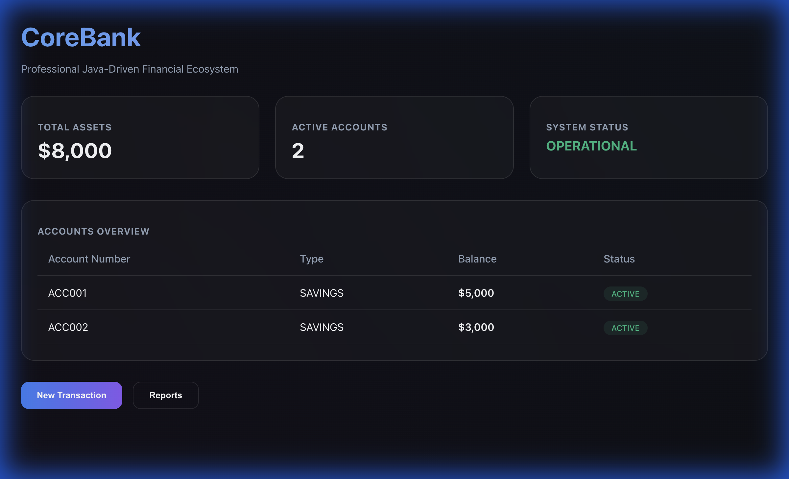
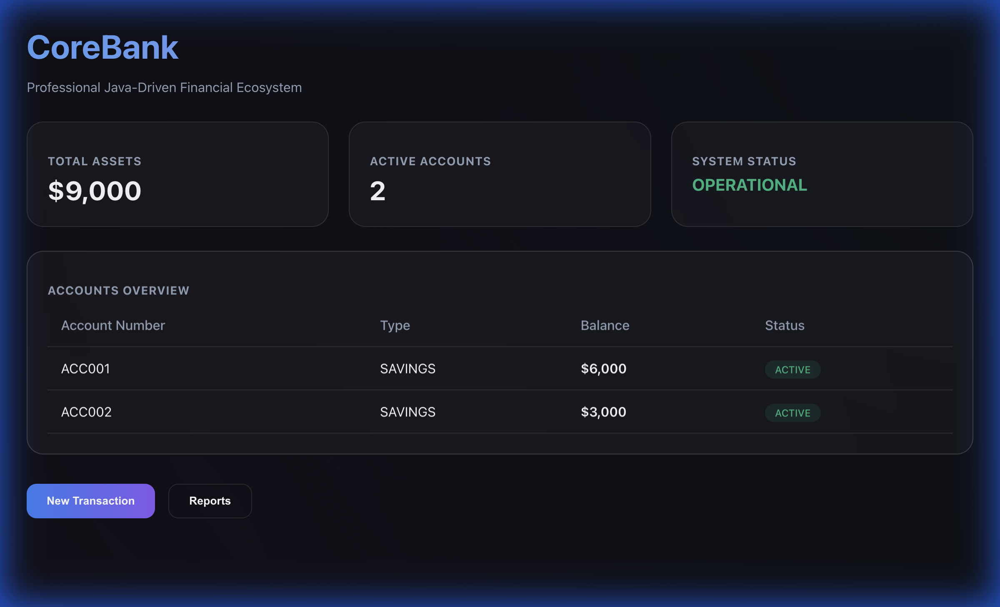
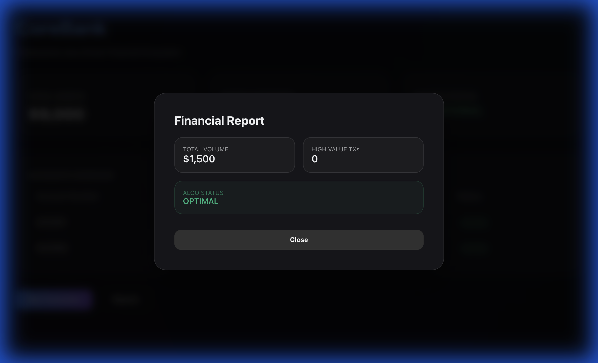
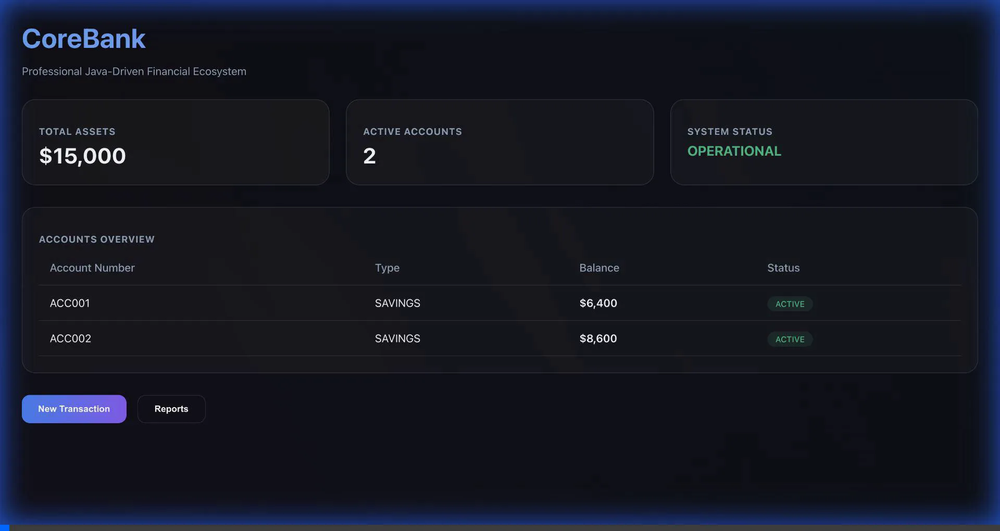

# CoreBank Pro - Industrial Strength Java Ecosystem

CoreBank Pro is a comprehensive, full-stack financial transaction system built with a "Pure Java" core. It evolves from a robust CLI tool into a modern web application, demonstrating advanced OOP patterns, concurrency, and high-performance data processing.

## 🌟 Features

- **Full-Stack Synergy**: Modern React frontend integrated with a native Java REST server.
- **High Concurrency**: Thread-safe transaction processing using `ReentrantLock` and `ExecutorService`.
- **Generic Persistence**: Generic File-based repository using Java Serialization.
- **Functional Analytics**: Real-time map-reduce reporting using Java 8 Streams and Lambdas.
- **Premium UI**: Dark-themed "Glassmorphism" dashboard with interactive transaction modals.

## 📸 Visual Showcase

### Interactive Dashboard
The main command center providing real-time financial metrics and account overviews.


### Real-Time Transactions
Process deposits, withdrawals, and transfers with instant UI feedback and backend atomic updates.


### AI-Driven Analytics
Deep-dive into transaction volumes and high-value metrics via the reporting engine.


## 🎥 Video Demonstration
Watch the system in action:


## 🛠 Tech Stack

### Backend (Pure Java)
- **Networking**: `com.sun.net.httpserver`
- **Concurrency**: `java.util.concurrent`
- **I/O**: Java Object Serialization
- **Processing**: Streams API, Lambdas

### Frontend
- **Framework**: React.js + Vite
- **Styling**: Vanilla CSS (Premium Glassmorphism)
- **API**: Standard Fetch API

## 🚀 Getting Started

### Prerequisites
- JDK 17 or higher
- Node.js & npm (v20+)

### Setup
1. **Clone the Repo**:
   ```bash
   git clone https://github.com/akashdoss/CoreBank.git
   cd CoreBank
   ```

2. **Run Backend**:
   ```bash
   javac com/corebank/CoreBankServer.java
   java com/corebank/CoreBankServer
   ```

3. **Run Frontend**:
   ```bash
   cd frontend
   npm install
   npm run dev
   ```

---
Developed with 💙 for industry-standard Java excellence.
